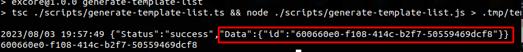

# About CLI

Experro CLI is a command-line interface tool that you use to initialize environment file, fetch data from server, build, and deploy the theme.

## Installation

You are already familiar with the process of installing the CLI. For reference, here is the command to install the CLI:

```sh
npm i -g experro-cli
```

After installation, you'll get `experro-cli` command in terminal.

Use the following command to show everything that's available:

```sh
experro-cli --help
Usage:
  experro-cli [OPTIONS] <command>

Help Options:
  -h, --help  Show this help message

Available commands:
  build        Build the app
  environment  Environment related commands
  init         Init the project
  server       Start the local server
  version      Version creation
```

Some of the commands accept options. Option names are prefixed with double dash (`--`) characters. If options requires the value, it should be in `--option-name=value` format.

---

### Available Commands
To use this commands you will need to have `CLI token` created, if you don't have CLI token, [Get CLI Token](./Get-CLI-Token.md).


---

<!-- theme: alert -->

> #### `init`
>
> ---
>
> This command helps to create **.env**. This file will contain information for: <br/>1. tenant-id <br/>2. workspace-id <br/>3. cli-token <br/>4. store-url <br/> For more information you can use help command: `experro-cli init --help` <br/>
>
> ```sh
> experro-cli init --cli-token='XXXXX' --tenant-id=<tenant-id> --workspace-id=<workspace-id> store-url=<store-hase>.experro.app
> ``` 
>To obtain the required parameters, you can get it from the CLI token generated in the Experro Admin panel and set them in the `experro-cli init` command.

 <!-- theme: alert -->

> #### `environment`
>
> ---
>
> This command lists the list of environments in the specified workspace. The information is retrieved from the .env file, which has been created using the aforementioned command `experro-cli init <--content-->`. <br/><br> To list down the environment you can use the command: <br/> `experro-cli environment list`

 <!-- theme: alert -->

> #### `server`
>
> ---
>
> This command is useful to **start the local server**. It will help you fetch the data from Experro's live store. <br/> `experro-cli server start`

 <!-- theme: alert -->

> #### `version`
>
> ---
>
> It allows you to create, delete, list and publish version's of the themes. <br/> To know more you can use this command: <br/>` experro-cli version --help` <br/><br/> 1. Create version <br/>2. Delete version <br/>3. List version <br/>4. Publish version <br/><br/>
> **1.  Create a version** : <br/>To create a version, simply use the command as shown below. Just assigned values of the `--name` and `--environment-id` with your specific values, then execute this command. Your latest version will be created, and the build with the provided `--name` will be uploaded to the admin panel.
> <br/>
>
> ```sh
> experro-cli version create --name=<theme-name/version-name> --environment-id=<environmnet-id>
> ```
>
> 
>
> After successfully creating a version, you will see an output similar to the screenshot above.
>
> **Note:** <br/> After successfully creating a version, an `id` will be displayed in your terminal (as shown in the screenshot above). Make sure to save this `id` for future reference, as it will be required to publish the uploaded version or perform other actions using Experro-cli.
> <br/>
>
> **2.  Delete a version** :<br/> This option will helpful to delete a uploaded version. You just need to provide `--tenant-id` `--wrokspace-id` `--cli-token` and `--version-id`. Version-id will be same as we have seen in above command as below
>```sh
> experro-cli version delete --tenant-id=<tenent-id> --workspace-id=<workspace-id> --cli-token=<cli-token> --version-id=<version-id>
>```
> <br/>
>
> **3.  List version**:<br/> The `list` option in the `version` command for `experro-cli` will display a list of all the versions that have been uploaded to the workspace. It will also show the status of each version, indicating which version is currently published.
>```sh
> experro-cli version list 
>```
> <br/>
>
> **4.  Publish version**:<br/> Option `publish version` will allow theme-developer to direclty publish the version which is created using command as below
>```sh
> experro-cli version publish --tenant-id=<tenent-id> --workspace-id=<workspace-id> --cli-token=<cli-token> --environment-id=<environment-id> --version-id=<version-id>
>```

<!-- theme: alert -->

> #### `build`
>
> ---
>
>This command is useful for creating an optimized local build.
>```sh
> experro-cli build --tenant-id=<tenent-id> --workspace-id=<workspace-id> --cli-token=<cli-token> --version-id=<version-id>
>```

---